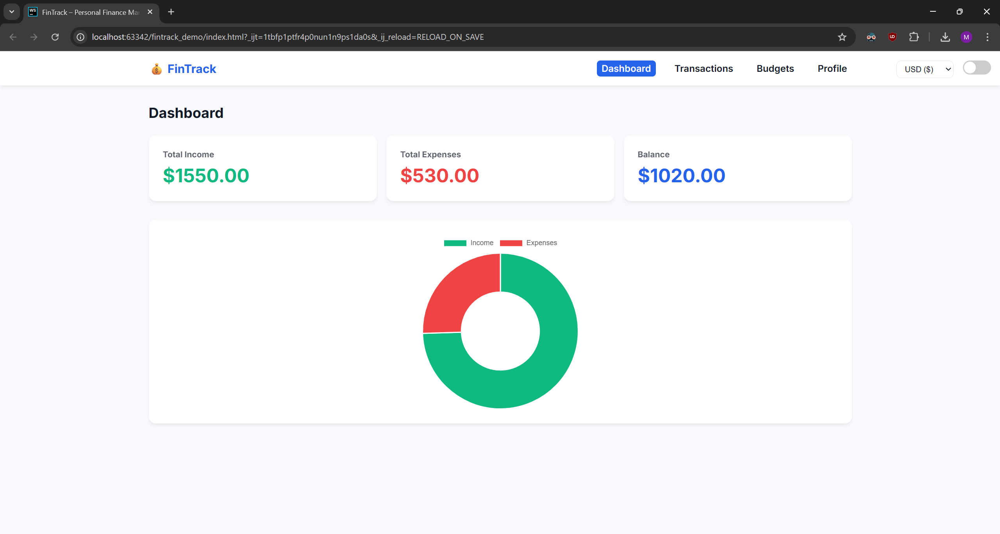
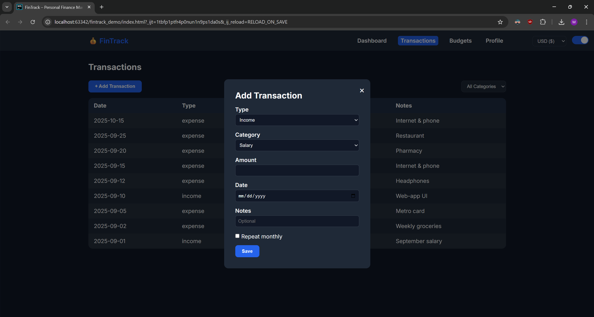
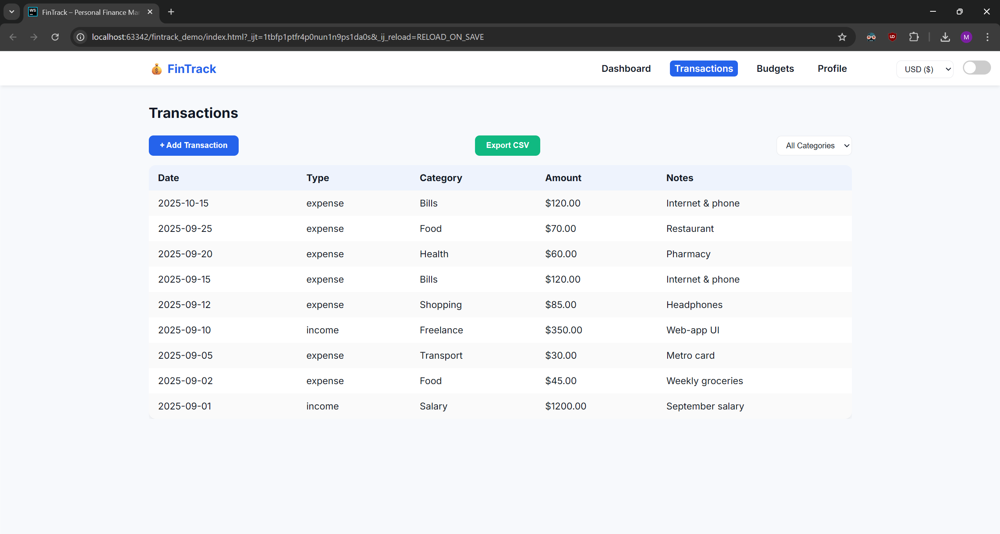
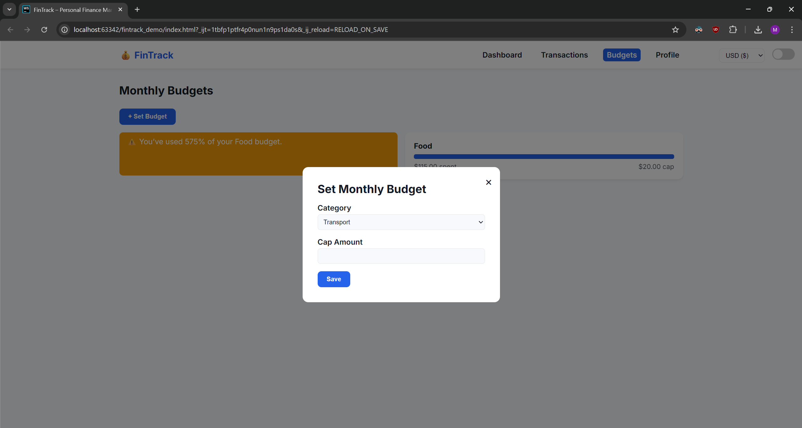

<h1 align="center">
  
   
  FinTrack – Personal Finance Manager
   
</h1>

  <a href="#features">Features</a> •
  <a href="#demo">Demo</a> •
  <a href="#install">Install</a> •
  <a href="#tech">Tech</a> •
  <a href="#license">License</a>

  
  
  
  

---

## ✨ Features
| Feature | Description |
|---------|-------------|
| 📊 **Dashboard** | Income, expenses & balance cards + doughnut chart |
| 🧾 **Transactions** | Add, edit, filter, export CSV |
| 🎯 **Budgets** | Monthly caps with live progress bars |
| 🔁 **Recurrent** | Auto-repeat transactions every month |
| 🌓 **Dark / Light** | System-aware theme + manual toggle |
| 🔒 **PIN Lock** | 4-digit PIN (default `0000`) |
| 📱 **PWA** | Install on iOS / Android, works offline |
| 🚀 **On-boarding** | Interactive tour for first-time users |
| ♿ **Responsive** | Mobile-first, tablet adaptive |
| 💾 **Auto-Backup** | JSON export every 24 h |

## 🎞 Demo Screenshots

| Dashboard (Dark) | Dashboard (Light) | Transactions (Dark) | Transactions (Light) |
|:----------------:|:-----------------:|:-------------------:|:--------------------:|
|  |  |  |  |

| Budgets (Dark) | Set Budgets (Light) | Add Transaction (Light) | Profile |
|:--------------:|:-------------------:|:------------------------:|:-------:|
|  |  |  |  |

## ⚡ Quick Start (no build tools)
1. Clone or download repo
2. Drop files into any static host (GitHub Pages, Netlify, Vercel, Apache, Nginx …)
3. Open `index.html` → install prompt on mobile

## 🔧 Customization
| Item | How |
|------|-----|
| Change PIN | `localStorage.setItem('fintrack-pin', '1234')` in console |
| Add currency | Add `<option>` in `#currencySelect` |
| Change colors | Edit CSS variables in `:root` |

## 📲 PWA Install
1. Open site in **Chrome / Safari**
2. Tap **"Add to Home Screen"**
3. Launch from app icon → offline ready

## 🛠 Tech Stack
| Layer | Tech |
|-------|------|
| UI | Vanilla HTML + CSS (Flex / Grid) |
| Charts | Chart.js CDN |
| Storage | localStorage |
| Tour | driver.js |
| Build | None (zero-config) |

## 📈 Roadmap Ideas
- [ ] Face ID / Touch ID unlock
- [ ] Cloud sync (optional backend)
- [ ] Multi-language support
- [ ] Recurring budgets (weekly / yearly)
- [ ] QR-code export

## 🙏 Acknowledgements
- [Chart.js](https://chartjs.org)
- [driver.js](https://driverjs.com)

- [Inter font](https://rsms.me/inter)
